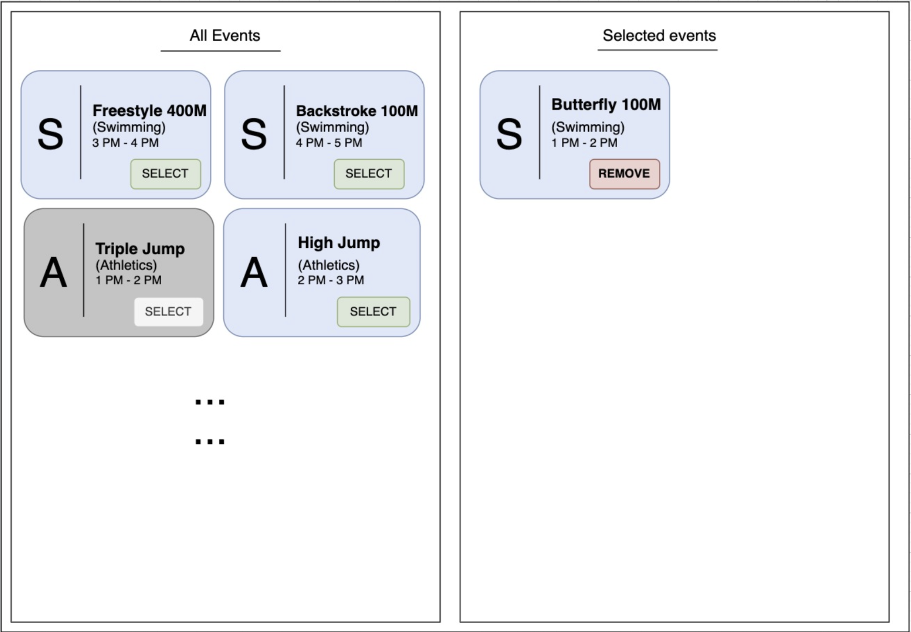

# Project Details

## Requirements
### 1. User Management
#### 1.1 User Registration
- Users should be able to create an account by providing a unique user ID, password and an email address or phone number.
- Users should be able to go to the login page from the account creation page if the user already has one account.

#### 1.2 User Login
- Users should be able to login using their unique user ID and password.
- Users should be able to go to the account creation page from the login page if the user
already does not have any account.

### 2. Event Registration
#### 2.1 Register for an Event
- Users should be able to register for an event by clicking a "Select" button associated with the event on the left hand side of the screen.
- Users should not be able to register for the same event more than once.
- Users should not be able to register more than 3 events at once.
- Users should not be able to register for events with conflicting timings.
- Users should not be able to register the same event twice.

#### 2.2 View Registered Events
- Users should be able to view all the events they registered on the right hand side of the screen.
- The registered events list shall include the same details as the event listing. 3.2.3 Unregister from an Event
- Users should be allowed to unregister from an event by clicking a "Deselect" button associated with the registered event.

## UserInterface
### 1. Event List Display
- The UI shall display all available events in a card format in the left hand side of the screen.
- Each card shall show the event name, category and timings, along with a button to select the event.

### 2. Selected Events Display
- The UI shall display a separate section for the user's registered events in a card format on the right hand side of the screen.
- Each registered event shall include the event name, category, and timings and a button to deselect the event.

## Error Handling
### 1. User Feedback
- The system shall provide appropriate error messages for various scenarios, including:
- Attempting to register for an already registered event.
- Providing a duplicate user ID during registration.
- Attempting to log in with an unrecognized user ID.
- Attempting to create another account with the same email/phone number.
- Selecting more than 3 events per user
- Selecting 2 events of overlapping time range.

# Getting Started with Create React App

This project was bootstrapped with [Create React App](https://github.com/facebook/create-react-app).

## Available Scripts

In the project directory, you can run:

### `npm start`

Runs the app in the development mode.\
Open [http://localhost:3000](http://localhost:3000) to view it in your browser.

The page will reload when you make changes.\
You may also see any lint errors in the console.

### `npm test`

Launches the test runner in the interactive watch mode.\
See the section about [running tests](https://facebook.github.io/create-react-app/docs/running-tests) for more information.

### `npm run build`

Builds the app for production to the `build` folder.\
It correctly bundles React in production mode and optimizes the build for the best performance.

The build is minified and the filenames include the hashes.\
Your app is ready to be deployed!

See the section about [deployment](https://facebook.github.io/create-react-app/docs/deployment) for more information.

### `npm run eject`

**Note: this is a one-way operation. Once you `eject`, you can't go back!**

If you aren't satisfied with the build tool and configuration choices, you can `eject` at any time. This command will remove the single build dependency from your project.

Instead, it will copy all the configuration files and the transitive dependencies (webpack, Babel, ESLint, etc) right into your project so you have full control over them. All of the commands except `eject` will still work, but they will point to the copied scripts so you can tweak them. At this point you're on your own.

You don't have to ever use `eject`. The curated feature set is suitable for small and middle deployments, and you shouldn't feel obligated to use this feature. However we understand that this tool wouldn't be useful if you couldn't customize it when you are ready for it.

## Learn More

You can learn more in the [Create React App documentation](https://facebook.github.io/create-react-app/docs/getting-started).

To learn React, check out the [React documentation](https://reactjs.org/).

### Code Splitting

This section has moved here: [https://facebook.github.io/create-react-app/docs/code-splitting](https://facebook.github.io/create-react-app/docs/code-splitting)

### Analyzing the Bundle Size

This section has moved here: [https://facebook.github.io/create-react-app/docs/analyzing-the-bundle-size](https://facebook.github.io/create-react-app/docs/analyzing-the-bundle-size)

### Making a Progressive Web App

This section has moved here: [https://facebook.github.io/create-react-app/docs/making-a-progressive-web-app](https://facebook.github.io/create-react-app/docs/making-a-progressive-web-app)

### Advanced Configuration

This section has moved here: [https://facebook.github.io/create-react-app/docs/advanced-configuration](https://facebook.github.io/create-react-app/docs/advanced-configuration)

### Deployment

This section has moved here: [https://facebook.github.io/create-react-app/docs/deployment](https://facebook.github.io/create-react-app/docs/deployment)

### `npm run build` fails to minify

This section has moved here: [https://facebook.github.io/create-react-app/docs/troubleshooting#npm-run-build-fails-to-minify](https://facebook.github.io/create-react-app/docs/troubleshooting#npm-run-build-fails-to-minify)
